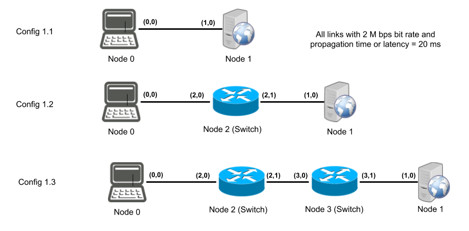
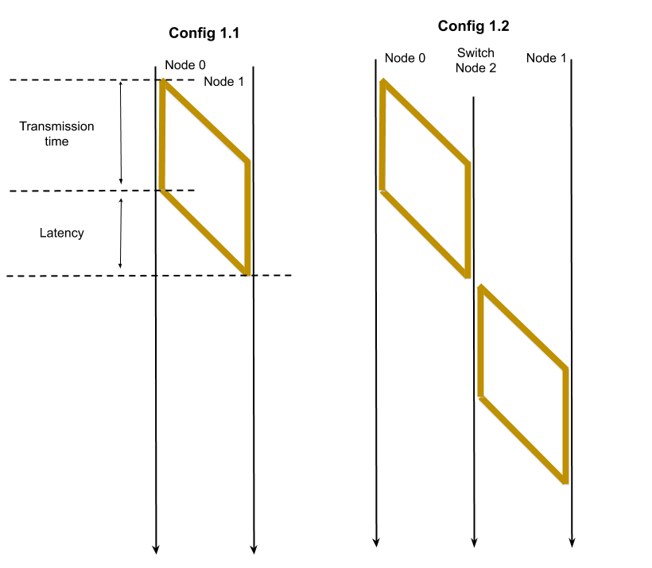
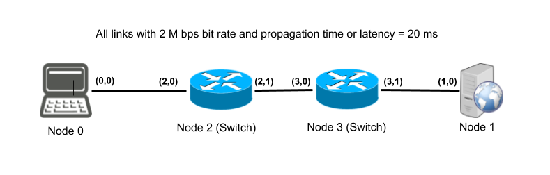

# RC 2020/2021 - Assignment 1

## Goals
With this assignment students will get a better understanding of how packet switching networks work, what is the transit time of packets in this type of networks and the way to compute it, and how packet switchning network properties impact the end-to-end performance of sending information from a node to another one.

## Assumptions
In what follows we will consider, by hypothesis, that all links are perfect and never corrupt or loose packets. The same property applies to nodes - they are bullet proof and never crash or loose packets. Also, as we are using CNSS, all computations are performed instantly, without any delay.

Network configurations of the different experiments made in this assignment use links with the same characteristics: bandwidth of 2 M bits per second, or 2,000,000 bps, and a propagation time, or latency, of 20 ms, since they have 4,000 Km each (4000 Km / 200,000 Km per second = 4 x 10^3 / 2 x 10^5 Km per second = 2 x 10^-2 s = 20 ms).

## Understanding store & forward, end-to-end transit time and the time required to transfer information in a packet switched network

**WARNING 1: please study section 3.2 and 3.3 of the book supporting the course to fully understand this section.**

**WARNING 2: please do not forget to update CNSS to its lastest version.**

In what follows, we are going to make several experiments with the goal of understanding which factors contribute to the transit time of a packet in a network, as well as to get a first glimpse of what impacts the time required to transfer information from one node to a different one in a packet switched network.

The three network configurations used in the first set of experiments [configs/config1.1.txt](configs/config1.1.txt), [configs/config1.2.txt](configs/config1.2.txt) and 
[configs/config1.3.txt](configs/config1.3.txt) are depicted in the figure below:

 .

The goal is to compute the time required to transfer a file from **node 0** to **node 1**, using two different solutions in these three different network configurations. 

With the first file transfer solution, **node 0** sends the file by sending **10** (it is easy to change that number) 10,000 bytes packets, back to back, to **node 1**. With the second solution, one payload of 10 x 10,000 bytes is sent in a single (big) packet.

The application code of **node 0**, the sender part, is in file [filesSender.java](files/filesSender.java). This application node sends in sequence and **immediately** during its initialisation, 10 packets of 10,000 bytes to **node 1**. The number of packets to send may be easily changed but, unless otherwise stated, we will always send 10 packets when the file is sent using several packets. Later, after 60 seconds, node 0 sends the same file in one only packet.

```java
public class filesSender extends AbstractApplicationAlgorithm {

	public static int BLOCKSIZE = 10000;            // 10000*8 = 80000 bits
	public static int TOTAL_PACKETSIZE = BLOCKSIZE+Packet.HEADERSIZE;


	int totSent = 0;
	int totalBlocks = 0;
	int filesize = 0;

	public filesSender() {
		super(true, "files-sender");
	}

	public int initialise(int now, int node_id, Node self, String[] args) {
		super.initialise(now, node_id, self, args);
		log(0, "starting");
		if ( args.length != 1 ) {
			System.err.println("files-sender: missing argument time "+now+"\n\n");
			System.exit(-1);
		}
		totalBlocks = Integer.parseInt(args[0]);
		for ( int i = 1; i <= totalBlocks; i++ ) {
			self.send( self.createDataPacket( 1, new byte[BLOCKSIZE]));
			log(now, "sent packet of size "+TOTAL_PACKETSIZE+" n. "+i);
		}
		self.set_timeout(60000); // 60 seconds later
		return 0;	
	}

	public void on_timeout(int now) {
		self.send( self.createDataPacket( 1, new byte[TOTAL_PACKETSIZE*totalBlocks]));
		log(now, "sent packet of size: "+TOTAL_PACKETSIZE*totalBlocks+" n. "+(totalBlocks+1));
	}

	public void on_receive(int now, DataPacket p) {
		log(now, "received ack "+p+ " w/ payload "+new String(p.getPayload()));
	}

	public void showState(int now) {
		System.out.println(name + " sent " + totSent + " packets with blocks");
	}

} 
```
The sender code deserves only a few comments. A ***timeout*** is setup during initialisation to set an alarm for 60000 ms or 60 seconds later. Thus, the sending of the file in one only packet, a big packet, is executed by the upcall `on_timeout()`. In order to make both tranfer solutions comparable, when one only packet is sent, its size has been addded of n times the size of the header of a packet (n times 20 bytes). Therefore, the total number of bytes transfered with the two solutions only differ by 20 bytes (the size of the header of the big packet). The application code of the sender node is prepared to receive an ack from the receiver. However, with these three experiments, no acks are sent by node 1, the receiver. The application uses logging to show how the transfer is progressing. The application code of the receiver node also uses logging to show when packets are received.

The only part of the receiver application deserving to be shown, look at file `filesReceiver.java`,  is its `on_receive()` upcall:

```java
  public void on_receive( int now, DataPacket p ) {
	  totReceived++;
	  log(now, "got: " + p + " n. "+totReceived);
  }
```
which merely logs packets reception and the total number of packets received up to the moment of each reception.

To complete the experiments you must download directory `assignment1` and  have it below the source code top level directory, usually `src`, since all java sources in `assignment1` belong to the package `package assignment1`.

To run experiment 1.1, assuming the current directory is above the `src/` directory (which contains `cnss/` and `assignment1/` directories) and that exists a `bin/` directory side by side the `src` directory (containing the executables), the following command does the job:

```
 java -cp bin cnss.simulator.Simulator src/assignment1/configs/config1.1.txt 
```
By following the output of the simulation it is easy to recognize that the 10th packet has been received at time 420, thus the file took 420 ms seconds to be transfered with the solution that sent 10 times 10,000 bytes packets, and also took 420 ms to be transferred in one only big packet of 100,000 bytes plus 200 bytes of headers. 

You can easily compute analytically these results. In order to fully understand how that should be done, you must study sections 3.2 and 3.3 of Chapter 3 of the book of the course. Transmission time (Tt) of a packet with 10,000 Bytes (80,000 bits) to a link with 2 Mbps bit rate is 40 ms (Tt = size in bits / bit rate = 80000 / 2000000 = 0,040). The transmission time of the big packet is 10 times this and the propagation time of the link is 20 ms.

After understanding everything you can now proceed to the next experiment, and give the following command:


```
 java -cp bin cnss.simulator.Simulator src/assignment1/configs/config1.2.txt 
```
You can also run the third experiment by issuing the same command with a different different configuration file:


```
src/assignment1/configs/config1.3.txt 
```

Now things become more interesting since the time that the two transfers took are different. It is worth noting that in the Internet, as well as in almost all networks, it is not possible to send packets as big as the big packet used to send the file in one only packet. NCSS makes no restrictions on the size of packets because it is a simulation tool. Nevertheless, the experiments also show that it is not very interesting to use huge sized packets (this is a relative concept related to the bandwidth of links) as we will see next.

In fact, in experiment 2, when the file is sent in 10 packets, it takes 480 ms to get to the destination, instead of 420 in the first experiment, while it takes 540 ms in the third experiment. You should repeat the analytical analysis required to understand why these results are obtained. From experiment 1 to 2, the transfer time increased 60 ms, while in experiment 3 it increased 60 ms over experiment 2 and 120 ms over experiment 1.

The increase from one experiment to the following one is related to the extra transmission time introduced by the extra switch and link, added to the latency of the extra link. You can use the figure below to better understand the reasons that explain it.


 .
 
As it is explained in the book, packet switched networks employ switches that use the **store & forward** principle, which states that packets must be fully received by a switch before being forwarded to the next one (or to an end-system). While the switch can send and receive several packets in parallel over different links, each packet can only be forwarded after being fully received, analysed and processed. It is only then that the outgoing interface in its way to the destination is choosen and its transmission may proceed. Thus, if we replace one link by several links interconnected by switches, even if the sum of the latencies of the new links is equal to the latency of the replaced one, each link introduces an extra transmission time to the packet end-to-end transfer time.

If we look now at the results of the three experiments in what concerns the transfer of the file in one only big packet, more lessons can be learned. In experiment 1, the transfer using one only packet took 420 ms to complete, the same when several packets were used. However in experiment 2 the same transfer takes 840 ms and 1260 ms in experiment 3. From one experiment to the following, the transfer time increased 420 ms. That increase is also due to the same reason, a transmission time plus the latency of the extra switch and link introduced eah time. However, now, the transmission time of the big packet takes 400 ms instead of the 40 ms that each "small" packet took. Figure

 
 
illustrates quite clearly the difference between experiments 1 and 2. The lesson is, if links have bit rates that introduce significant transmission times, increasing the size of packets may introduce unexpected increases in transit time. 

Before proceeding you should review the 3 experiments and take a sheet of paper and redo the calculations in the three cases to compare your computations with the results shown by the simulations. You should be convinced at the end, that computing transfer times in a network where no packets are lost, and there is no competing traffic (other sources sending packets that cross the same links that your packets also cross) it is very easy.

You can also repeat the same experiments with bigger files (more packets) or with links with higher bit rates. If you increase the bandwithd of links from 2 Mbps, to, for example, 100 Mbps or to 1000 Mbps (1 Gbps), the transmission times become very small. For example, sending 80,000 bits at 1 Mbps requires 80 ms, while sending the same packet at 1 Gbps only requires 0,08 ms or 80 micro seconds. As the bandwidth increases, the dominant factor in end-to-end transit time is links latency.

**Warning:** when changing a configuration file, you should pay attention to the fact that you may not make mistakes or otherwise NCSS crashes miserably. In particular, each token in the file must be separated from the nex one by exactly one space character and you must not enter lines with only spaces. In a next version we will improve the configuration file parsing habilities of CNSS.

A last interesting observation concerning CNSS is related to the fact that these three configuration files have no `stop parameter`. Sometimes it is not required to introduce one, since CNSS recognizes that no more events can be fired in the simulation and stops its processing.

## Data Transmission with Flow Control

In real networks several problems may arise, like packets being lost or delivered out of order to receiver nodes. The previous experiments solutions cannot deal with these real world problems and will fail, since the data sent and received may differ. In assignment 2 we will study methods to deal with these characetristics of real networks.

Additionally, the previous shown data transfer solutions also cannot deal with another problem, related, not with the network, but with the characteristics of real world nodes, namely, the fact that their processing capacities are different. Therefore, a very powerful node can send data at a rate that a less powerful receiver one is not able to process timely. If that is the case, packets may also be lost because the receiver cannot process all the packets that it receives, and the only solution is to discard some of them. The final result is the same as if these discarded packets were not delivered by the network.

Solutions to this problem are know as ***flow adaptation or flow control*** solutions, that provide methods to adapt the sending rate of senders to the processing rate of receivers. 

There exists another problem of rate adaptation related with the fact that an high capacity sender can saturate a network not able to deliver packets sent at a too high rate. For example, at the same time, other nodes are also sending many packets that cross the same links as our high performance sender. In that case, it is also necessary to adapt the rate of the sending nodes to the capacity available inside the network. The solution to this probleam is called ***network congestion control***. 

Flow control methods and network congestion control methods are different, but both share some common characteristics. In fact, both may rely on signals sent by receivers (or the network) to senders, telling them to stop, refraining sending packets, or to continue sending them. Both methods are discussed in several chapters of the book, namely chapters 6, 7 and 8. By now you do not need to study these chapters to understand this assignment, but you will need them for the next assigments.

### The Stop and Wait Flow Control

The simplest method of flow control is know as "Stop & Wait" flow control or S&W for short. S&W is also the name of the protocol that relies on this method. It is a very simple protocol. Each time the sender sends a packet, it will enter a waiting phase, up to reception of a signal from the receiver meaning that it received the packet and it is ready for the next one. These small signal packets are known as acknowledgement packets or ACK packets.

The application algorithm of a receiver node using this protocol is available in file `FilesReceiverAck.java`. Again, the only upcall worth discussion is the `on_receive()`one.

```java
  public void on_receive( int now, DataPacket p ) {
      totReceived++;
      log(now, "got: " + p + " n: "+(int)(p.getPayload()[0]));
      self.send( self.createDataPacket( p.getSource(), ("ack "+totReceived).getBytes() ) );
  }
```
It logs the reception of the packet and answers the sender sending it an ACK packet with the number of received packets up to now (including this one).

The code of the sender node is a litle bit more elaborated. It is contained in file `NaifSwSender.java` and it is shown next (we only show the `initialise()`, `on_receive()` and `showState()` methods). We call this solution and the next ones ***Naif*** since they are not acceptable for real world scenarios where networks may loose packets.

```java
public class NaifSwSender extends AbstractApplicationAlgorithm {

.....

	public int initialise(int now, int node_id, Node self, String[] args) {
		super.initialise(now, node_id, self, args);
		if ( args.length != 1 ) {
			System.err.println("files-sender: missing argument time "+now+"\n\n");
			System.exit(-1);
		}
		totalBlocks = Integer.parseInt(args[0]);
		log(0, "starting");
		startTime = now;
		totSent = 1;
		byte[] pl = new byte[BLOCKSIZE];
		pl[0]= (byte) ( totSent & 0xff ); 
		self.send( self.createDataPacket( 1, pl ));
		log(now, "sent packet of size "+TOTAL_PACKETSIZE+" n. "+totSent);	
		return 0;	
	}


	public void on_receive(int now, DataPacket p) {
		log(now, "ack packet: "+p+" pl: "+new String(p.getPayload())+" n. "+totSent);
		if (totSent <= totalBlocks - 1) {
			totSent++;
			byte[] pl = new byte[BLOCKSIZE];
			pl[0]= (byte) ( totSent & 0xff ); 
			self.send( self.createDataPacket( 1, pl ));
			log(now, "sent packet of size "+TOTAL_PACKETSIZE+" n. "+totSent);		
		} else if (totSent == totalBlocks ) {		
			transferTime = now - startTime;
			totBytesTransferred = TOTAL_PACKETSIZE*totalBlocks;
			float transferTimeInSeconds = (float)transferTime / 1000;
			e2eTransferRate = (int) (totBytesTransferred*8 / transferTimeInSeconds);
			log(now, totBytesTransferred+" bytes transferred in "+transferTime+" ms at "+e2eTransferRate+" bps e2e rate");
		}
	}

	public void showState(int now) {
		System.out.println(name + " sent " + totSent + " packets with blocks");
		System.out.println(name+" "+totBytesTransferred+" bytes transferred in "
				+transferTime+" ms at "+e2eTransferRate+" bps e2e rate");
	}

}
```

The sender, after the initialisation of its variables, sends the first packet. Then, each time it receives a packet from the receiver (an ACK), it proceeds to the next packet (while not all packets have been sent and acked). When the last ACK is received, it computes the transfer rate and prints it. For the sake of increasing clarity of the logs (nothing more) it puts in the first byte of the sent packet its order (thus, if more than 254 packets are sent, this number will turn to 0 again).

All the following experiments are performed by using the network configuration below, which is already known.



It is now interesting to experiment the transfer of the file with this new solution. That is easily done using configuration `config.1.4.txt` and performing experiment 4 with the following command:

```
java -cp bin ... .Simulator src/assignment1/configs/config1.4.txt 
```

The result of the experiment shows that the transfer of the file took 2400 ms, much longer than in previous experiments, at an end-to-end rate of 334,000 bits per second or around 1/3 of the links bandwidth.

It is interesting to explain these results while also computing them analytically. You should also compute what is called the ***usage ratio*** of the links. If you have doubts, chapter 6 of the book may help you.

Another experiment with the same protocol and network configuration is experiment 5, which uses the configuration file and command:

```
java -cp bin ... .Simulator src/assignment1/configs/config1.5.txt 
```
during which a file with 100 packets size, instead of 10, is transferred. The result, as expected, show an identical end-to-end transfer rate. This experiment will be used as a reference to the next experiments.


### Another Solution to the Simulation of the S&W Protocol with CNSS

CNSS has a feature that allows the application algorithm of a node to run a periodic processing step. This can be achieved by making method `initialise()` to return the required periodic execution period. For example, if that method returns 1, the node can execute an action everytime time the clock advances. Each time the clock ticks, the node kernel calls the upcall `on_clock_tick()` where one can state what should be periodically executed.

File `NaifSwSenderP.java` contains another CNSS simulation of the S&W protocol. With that solution, shown below, only some methods are important. The `initialise()` method, not shown, is very simple since it only initialises the process and all the requiered variables. At the end it returns 1 to require the the execution of the upcall `on_clock_tick()` every time the clock advances. We also do not show the `showState()` method since it is identical to the previous solution. The only real important upcalls are those shown.

```java
public void on_clock_tick(int now) {
		if ( mayProceed && totSent < totalBlocks) {
			totSent++;
			byte[] pl = new byte[BLOCKSIZE];
			pl[0]= (byte) ( totSent & 0xff ); 
			self.send( self.createDataPacket( 1, pl ));
			log(now, "sent packet of size "+TOTAL_PACKETSIZE+" n. "+totSent);
			mayProceed = false;
		}
	}

	public void on_receive(int now, DataPacket p) {
		log(now, "ack packet: "+p+" pl: "+new String(p.getPayload()));
		mayProceed = true;
		if (totSent == totalBlocks ) {
			transferTime = now - startTime;
			totBytesTransferred = TOTAL_PACKETSIZE*totalBlocks;
			float transferTimeInSeconds = (float)transferTime / 1000;
			e2eTransferRate = (int)(totBytesTransferred*8 / transferTimeInSeconds);
			log(now, totBytesTransferred+" bytes transferred in "+transferTime+" ms at "+e2eTransferRate+" bps e2e rate");
		}
	}
```

The `on_clock_tick(int now)` upcall executes a regular ***pattern***: it tests conditions before performing some action (the action pre-conditions). If these conditions are met, it executes some action, otherwise does nothing. There may exist more than one action, each with its own pre-condition. In the presented example, the precondition is 

```java
mayProceed && totSent < totalBlocks
```

that is, there are data blocks or packets to send (we have not yet sent them all) and nothing prevents us from sending. If that pre-condition is valid, a packet is sent and the variable `mayProceed` becomes false, since the sender enters the wait state, waiting for the reception of the ACK (the "stop transmitting and wait" in the name S&W of the protocol). In fact, that variable records the state of the execution of the protocol. If it is `true`, the sender can send one packet, otherwise it must wait for this state to become `true`, i.e., "one more packet can be sent if one is available".

The `on_receive(...)` upcall processes the received ACKs. It logs the reception and changes the state to `mayProceed = true` since the sender may proceed. If it is the last ACK, it computes the transfer rate. 

This pattern of an  application algorithm is well suited to express algorithms as automata. The upcalls `on_clock_tick()`, `on_receive()`, `on_timeout()` etc. may all be structured as a kind of "switch" over state conditions (or automaton state), perform the state corresponding actions and possibly send packets, and, finally, update the state. This kind of pattern is useful to structure certain protocol algorithms better than with a serial sequence of series of actions. With this pattern, these algorithms in CNSS execute as a succession of processing steps, each made of actions related to the current state, followed by a state change, and then wait for the next processing step or event. It is what is called an event-processing like program structure.

In CNSS these automata are never ending and may perform too much empty actions if they use very small `clock_ticks`. Small clock periods may be required to answer state changes timely. In the real world, that would be a solution that wastes CPU cycles, however, as this is just a simulation, the pattern may be implemented as illustrated, without very severe drawbacks. Parameter `stop` can be used to prevent the simulation of never ending. The only bizarre side efefct is the warning shown by CNSS:

```
warning - 1 events not run; stoped too early?
```

because the next clock tick was not executed. It is also possible to stop  the simulation calling `System.exit()` in an upcall, but that should be considered bad practive since it is an abrupt halt and may prevent the processing of some events scheduled to happen later.

Experiment number 6 corresponds to the transfer of a file of 100 packets from node 0 to node 1 using the `NaifSwSenderP.java` implementation of the S&W protocol. You can run it by issuing the command

```
java -cp bin ... .Simulator src/assignment1/configs/config1.6.txt
```

It is interesting to note that this solution takes 1 extra millisecond than the previous one. Can you explain it? You may think of when the first packet has been sent and if it takes extra time from receiving an ACK and sending the next packet.

For the sake of practicing this new pattern, you must use it in the next deliveries.

# Fisrt delivery - Fixed Window Sending Protocols

You noticed that the S&W protocol showed, in previous experiments, an end-to-end transfer rate lower than the capacity of the links. This can be improved using what are called ***sliding window protocols***, see chapter 6 of the book if you want to study them in advance. With the S&W protocol, one only packet can be in transit from the sender to the receiver, i.e., sent and not yet acknowledged. Sliding window protocols allow a certain number (N) of packets, with N ≥ 1, to be sent by the sender in advance.  N is called the size of the window and may be defined as the number of packets in transit from the sender to the receiver, i.e., packets already sent but not yet acknowledged.

For example, with a window of size 2, that is with N = 2, two packets may be sent in adavance, and whenever an ACK is received, one more packet can be sent, etc. It is also possible to implement the same idea by sending 2 packets, one after the other in sequence, waiting for their 2 ACKs, and then transmitting 2 more packets, and then, starting all over again after receiving 2 more ACKs, etc. However, the former way we described the algorithm may be more performant than the last in certain conditions (this is an hard issue to be understood) and thats the preferred one.

Your sender algorithm shoud be called `NaifWindSender.java` and must have two parameters: the size of the file, given as the number of packets to send, and the size of window. It must be structured the same way as algorithm `NaifSwSenderP.java` and use the same methods to compute the end-to-end transfer rate and the same method  `showStatus()` (contained in file `NaifSwSender.java`). The receiver is the one in file `FilesReceiverAck.java`.

Experiments 7, 8 and 9 (look at the contents of their configuration files) contain the 3 experiments that you must successfully run. Files `results/config1.7.txt`, `results/config1.8.txt` and `results/config1.9.txt` contain the log results your solution must produce. Your solution is correct if it produces the same results as the ones contained in these files. You may test it using, for example, program `diff` to compare your output (stored in a file) with these files.

Instructors may also test your solution with different parameters than those presented above. You must be prepared to discuss the results of each experiment, namely the values of the end-to-end transfer rates obtained in each case and to compare them with the results of the S&W protocol.


 
# Second delivery - Dynamically Increasing Window Size Protocols

The previous sliding window algorithm uses a contantly sized sending window. In certain circunstances, the sender has no information on the correct size to use. One solution may be to start at a very low transmission rate, and then, if everything is ok, to increase it. Some of these dynamically sized window algorithms can be characterized as additive increasing algorithms or exponentially increasing algorithms. Additive increasing algorithm add 1 to the size of the window when all the packets of the previous window have been acknowledged. Exponentially incresing algorithms double the size of the window when all the packets of the previous window have been acknowledged.

For example, in the first round, one packet is sent and its ACK received. In the following round, 2 packets are sent and 2 ACKs are received. In the next one, 4 packets are sent and 4 ACKs are received, and so on. In round K, `2^(K-1)` packets are sent and the same number of ACKs received. 
You are required to implement this exact algorithm.

Your sender algorithm shoud be called `NaifMincSender` and has one parameter, the number of packets to send, i.e. the size of the file. It must be structured the same way as algorithm `NaifSwSenderP.java` and use the same methods to compute the end-to-end transfer rate, as well as the method  `showStatus()`. The receiver is the same, the one in file `FilesReceiverAck.java`.

Experiment 10 (look at the contents of its configuration file) contains the configuration of the experiment that you must be able to run. File
 `results/config1.10.txt` contains the log results your solution must produce. Your solution is correct if it produces the same results. You may test it using, for example, program `diff` to compare your output (stored in a file) with file  `results/config1.10.txt`.

Instructors may also test your solution with different parameters than those presented above. You must be prepared to discuss the results of your experiment, namely the values of the end-to-end transfer rate, and to compare them with the results of the S&W protocol.


