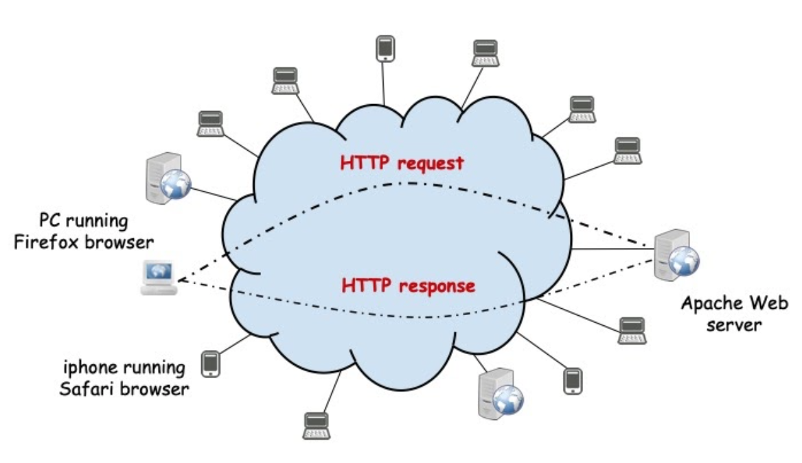

# Assignment 3: A smart client to download content from one or multiple HTTP servers

# PART II - Introduction to HTTP and Delivery

## Summary

- HTTP Protocol
- Examples and utilities
- HTTP gets using ranges
- File transfer over HTTP with and without ranges
- Delivery

### HTTP Protocol

- HTTP is a client / server protocol supported by TCP channels
- The server expects the client to open a TCP connection to its port (by default the port 80)
- In version 1.0 of the protocol, each request / reply HTTP transaction uses a different TCP connection
- In version 1.1 several HTTP transactions can share the same TCP connection
- Versions 2 and 3 of HTTP support parallel transaction over the same TCP connection (version 2) or over UDP (version 3) but we will not discuss them here
- Chapters 12 and 13 of the course support book have a discussion on HTTP and how it is used for content distribution nowadays



### Example of HTTP Request/Reply Messages

**HTTP Request Message**

```
GET /index.html HTTP/1.0 <CRLF>
Host: di115.di.fct.unl.pt <CRLF>
User-Agent: Mozzilla/40.01 <CRLF>
<CRLF>
```

**HTTP Reply Message** (only included some lines)

```
HTTP/1.1 200 OK<CRLF>
Date: Wed, 21 Oct 2020 21:50:14 GMT<CRLF>
Server: Apache/2.4.29 (Ubuntu)<CRLF>
Last-Modified: Sat, 04 Apr 2020 18:41:38 GMT<CRLF>
ETag: "12a0-5a27b62627f20"<CRLF>
Accept-Ranges: bytes<CRLF>
Content-Length: 4768<CRLF>
Vary: Accept-Encoding<CRLF>
Connection: close<CRLF>
Content-Type: text/html<CRLF>
....
<CRLF>
....            //  Downloaded Data corresponding to the request
```

### HTTP Request header-fields

There are many different request header-fields that the client can send to the sever into the request message header. Below you will find some of a very long list that you can find in the bibliography:

```
User-Agent:		ex., User-AGent_ Mozilla/4.0.0
Accept-Charset:		ex., Accept-Charset: utf-8
Accept-Encoding:	ex., Accept-Encoding: gzip
Accept-Language:	ex-. Accep-Language: en-UK
If-Modified-Since:	ex., If-Modified-Since: Tue, 02 Oct 2020 14:35:41 GMT
If-Match:		ex: If-Match: "735667ds8siAB76E78FE.....9537C2D"
Range:			exx. Range: bytes=500-999
```

### HTTP requests made "by hand"

**By using the following command**, you can access an HTTP server to see its replies. Try the following one:

```
telnet asc.di.fct.unl.pt 80
GET / HTTP/1.0 <return>
<return>
.... analyze the result.
```

**... or the following one:**

```
telnet www.google.com 80
GET / HTTP/1.0 <return>
<return>
.... analyze the result.
```

**If your system doesn't have the telnet command, you can use instead the nc command**:

```
nc -c asc.di.fct.unl.pt 80
GET / HTTP/1.0 <return>
<return>
.... analyze the result.
```

**Or the following one:**

```
nc -c www.google.com 80
GET / HTTP/1.0 <return>
<return>
.... analyze the result.
```

### HTTP Reply: header-fields

The server sends information to the client by also using the header of the reply message, which is composed of different reply header-fields. These header-fields contains several informations, namely the reply object meta data, that are usefull to the client.

```
Server:			ex., Server: Apache
Last-Modified:		ex., Last-Modified: Wed 21 Oct 2020 22:31:24 GMT
Content-Type:		ex., Content-Type: text/html; charset=utf-8
Content-Legnth:		ex., Content-Length: 438
Content-Encoding:	ex., Content-Encoding: gzip
ETag:			ex., ETag: "3d2-52aca46b79fd9"
Accept-Ranges:		ex., Accept-Ranges: bytes
```

### Java code utilities and examples

The `java.net` package has many classes to speedup the development of programs using network protocols. In what concerns the protocol HTTP, there is one, among many, that can be used to parse and access URLs:

**Class URL** 
The URL class allows parsing an url to get its different components. See file `URLparse.java` in the source code repository
There are many other classes available in the same package to develop programs based on the HTTP protocol. However, due to pedagogical reasons, you can only use the class URL to parse an url. 
Any other requierements of your programs should be implemented by yourself or using the class `Http`, available in the source code repository, which provides some extra methods to facilitate the development of Java programs build directly on top of the HTTP Protocol.

**Below you will find several Java source code examples:**

**Parsing an URL and opening a TCP connection to the server contained in the URL**

```java
String url = args[0]; // for example "http://google.com"
URL u = new URL(url);
// Assuming URL of the form http://server-name/path ....
int port = u.getPort() == -1 ? 80 : u.getPort();
String path = u.getPath() == "" ? "/" : u.getPath();
Socket sock = new Socket( u.getHost(), port );
OutputStream out = sock.getOutputStream();
```

**Composing and sending a request contained in `URL u` to a server**

```java
String request = String.format(
"GET %s HTTP/1.0\r\n"+
"Host: %s\r\n"+
"User-Agent: X-RC2020\r\n\r\n", path, u.getHost());
out.write(request.getBytes());
```

**Parsing a request message header in a server**

```java
line = Http.readLine(in);
String[] request = Http.parseHttpRequest(line);
line = Http.readLine(in);
// reading the rest of the request message header
while ( ! line.equals("") ) {
     line = Http.readLine(in);
}
if( request[0].equalsIgnoreCase("GET") && request[1] != "") {
     sendFile(request[1], out);
} else {
     sendsNotSupportedPage(out);
```

**Example: sending a reply error message to the client**
```java
/**
* Sends an error message "Not Implemented"
*/
private static void sendsNotSupportedPage(OutputStream out) 
throws IOException {
   String page = 
      "<HTML><BODY>Demo server: request Not Implemented</BODY></HTML>";
   int length = page.length();
   String header = "HTTP/1.0 501 Not Implemented\r\n";
   header += "Date: "+new Date().toString()+"\r\n";
   header += "Content-type: text/html\r\n";
   header += "Server: "+"X-Server-RC2018"+"\r\n";
   header += "Content-Length: "+String.valueOf(length)+"\r\n\r\n";
   header += page;
   out.write(header.getBytes());
}
```

**Example: Sending a file in an HTTP reply message - the reply header and payload**

```java
File f = new File(name);
long size = f.length();
FileInputStream file = new FileInputStream(f);
StringBuilder header = new StringBuilder("HTTP/1.0 200 OK\r\n");
header.append("Server: "+"X-Server-RC2018"+"\r\n");
header.append("Content-Length: "+String.valueOf(size)+"\r\n\r\n");
out.write(header.toString().getBytes());
// send payload
byte[] buffer = new byte[1024];
for(;;) {
   int n = file.read(buffer);
   if( n == -1) break;
   out.write(buffer, 0, n);
}
```
### Demos: HTTP client and server

In the source code repository you will find a very simple HTTP client [**SimpleHttpClient.java**](./exemplo3/SimpleHttpClient.java) that is able to request an object denoted by the url given as argument. The reply of the server is shown to the user (but it is not parsed, nor interpreted).

Study its code and try to access some other urls like for example:

- ``http://google.com``
- ``http://www.google.com``
- ``http://asc.di.fct.unl.pt``
- ``http://asc.di.fct.unl.pt/rc``

Explain the output and understand how it works.

In the [**source code repository**](./exemplo3) you will also find an HTTP server named  HttpTrickyServer (only the classess `HttpTrickyServer.class` and `Http.class` and the jar `HttpTrickyServer.jar` are provided) that is able to serve the requested files from its local file system. You can run the server using the command `java -cp . HttpTrickyServer` (assuming `HttpTrickyServer.class` and `Http.class` files are in the same directory) or the command `java -jar HttpTrickyServer.jar 8080` for example.

Later on, you will understand better why the server has the word **Tricky** in its name. By now, you can use the browser of your choice and try to access URL `http://localhost:8080`. The browser will show the answer received from the server.

You can also try to access the URL: `http://localhost:8080/some_filename.java`. For example, if the server is executing in your localhost, and if in its current directory you find files called [**index.html**](./exemplo3/index.html),  [**earth.jpg**](./exemplo3/earth.jpg) and [**HttpLazyServer.java**](./exemplo3/HttpLazyServer.java), using the **HttpTrickyServer** and the URLs `http://localhost:8080/index.html`,  `http://localhost:8080/earth.jpg` or `http://localhost:8080/HttpLazyServer.java`, you can obtain the contents of these files. It will be similar for any other object you want to download from the server.

If you have python installed in your system, you can understand better how the Tricky and Lazy servers behave, you can try the same browser access to [**earth.jpg**](./exemplo3/earth.jpg) using a normal HTTP server that you can run using the command  `python -m SimpleHTTPServer 8080`.


## Hands-On: Programming Execise
The provided **SimpleHttpClient**  is able to use the HTTP request / reply protocol to obtain a file and show its content. 
Departing from this class, find a way that may be used to download files from an HTTP server to be stored in a local file (in the client side). 
Call your class **GetFile.java** for example. You can follow a code structure as initially proposed in **GetFile.java**.

In the source code repository there is another class [**GetURL.java**](./exemplo3/GetURL.java) which uses the class URL to download an object from an HTTP server. 
It is shown just for study purposes and you can use it to download contents from web servers or also from the **HttpTrickyServer**. However, due to pedagogical reasons, you also cann't use it to complete any of your exercises.

## HTTP using Range Requests

### Range Requests

During the (already very long) life of the HTTP protocol, many extensions have been introduced. Most of those extensions introduced new request and reply headers-fields.
To facilitate the access to very big or huge objects, HTTP supports partial requests. This feature is inspired from reading direct access files in slices.
To make a partial request, one needs at least two resources:

- An HTTP server that understands range requests and replies to them
- A client using the range request header-field. Examples:
- Range: bytes=100-199   // requesting the 100 bytes starting with byte 100
- Range: bytes=100-      // requesting from byte 100 to the end of the object

### HTTP request made "by hand"

**By using the following commands**, you can access an HTTP server to see its replies. Try the following one:

```
telnet asc.di.fct.unl.pt 80
GET / HTTP/1.0 <return>
Range: bytes=10-20 <return>
<return>
.... analyze the result.
```

**Source code example:**

```java
OutputStream out = sock.getOutputStream();
String request = String.format("GET %s HTTP/1.0\r\n"+
"Host: %s\r\n"+
"Range: bytes=100-199\r\n"+
"User-Agent: X-RC2018\r\n\r\n", path, u.getHost());
out.write(request.getBytes());
```

You can learn about this feature of the HTTP protocol by starting here or looking at RFC 7233, as well as, in the Course Book.

Range requests and replies are specially useful to deal with multimedia information.

In the source code repository you will also find a lazy HTTP server [**HttpLazyServer.java**](./exemplo3/HttpLazyServer.java) that is able to serve the requested files and partially supports ranges. In fact, the full support of RFC 7233 ranges is quite complex and extensive. The provided server only supports ranges of the forms shown above. This server is lazy since it only sends at most MAX_BYTES bytes in each reply. You can find this constant in its source file. Therefore, if you want to know it, you should use the RTFC method (Read The F. Code), which is the only accessible method when no manual is available.
To test the actions of the lazy server, launch it in a directory where you also put the file Earth.jpg (which size is around 13 Mbytes). You can access it by using the url: 
`http://localhost:8080/Earth.jpg` using the browser of your choice.

# Parte III - Assignment 3 Delivery

## Delivery: [A ``smart``client to get a file from a Http Server or from a cluster of HTTP Servers, using successive range downloads](./DELIVERY.md)

