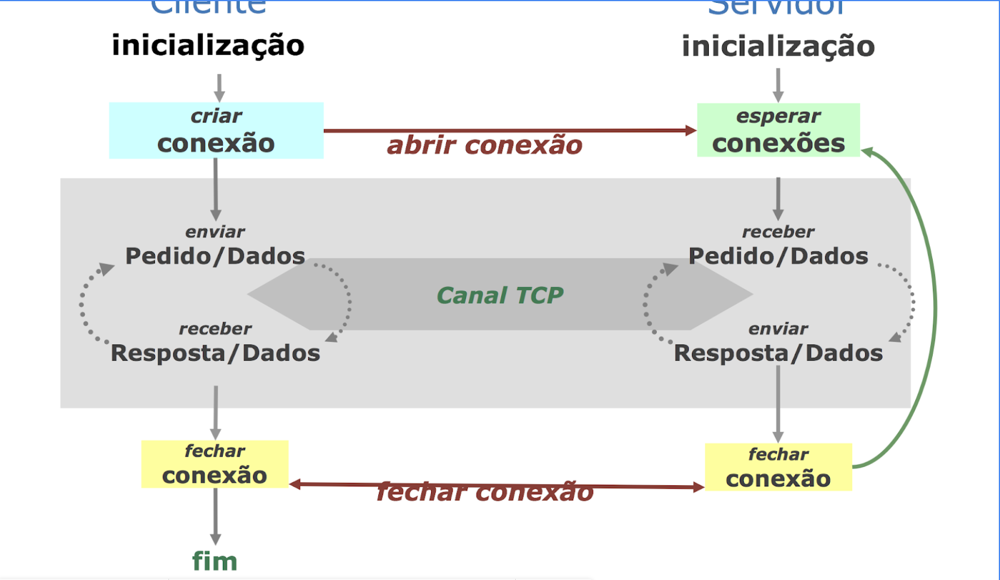

# Assignment 3: A robust client to download content from one or multiple HTTP servers

## Objectives

In this Assignment and its Guidelines you will learn how to program with Sockets to program client/server applications supported by TCP and how to program clients that can transfer contents from HTTTP servers. After the initial guidance, diivded into two parts, the final goal is to implement a Client/Server application for File Transfer based on HTTP, where clients can download files from several web-servers used in parallel, in order to maximize the file transfer rate. 
For the assignmemt the implementation of the web-servers are provided as initial material. the assignmemt consists in the developmet of the required client implementation.

## Motivation

In today's internet, most of the users consumed content is carried over the HTTP protocol. In the specific case of multimedia contents, the volume of the consumed information varies from a few Mbytes (in the case of photographs), up to several Gbytes (in the case of movies).

It is not realistic to think of such bulky objects being transferred in a single HTTP request/reply interaction and using a single TCP connection. 

Inevitably, due to the high volumes of data, momentary anomalies in the network, or problems in the servers, it is necessary to resort to more than one interaction among the client and the server(s). In addition, in the case of movies, as they can take hours to play, it is not mandatory or interesting to transfer in only one chunk the full content, or from the same server. 

Also, a faster download may be achieved **if transferring in parallel from several servers, using different HTTP ranges**.

## Guidelines

To address the Work-Assigmnment 3 and its deliverables you must follow the following guidelines:

* **Backgound and references**
    * **Progamming with TCP Sockets in Java**
    * **HTTP Protocol and How to DOwnload Digital Objects from HTTP Servers**
* **PART I: Networking Programming using TCP Sockets in Java**
* **PART II: Using the HTTP Protocol to Download Digital Objects from a Server**
* **PART III: Assignment 3 Deliverables: Delivery 3.1 and Delivery 3.2**

# Background and initial references

### Programming with TCP Sockets in Java

- You can find a **tutorial on programming with Sockets in Java Language** in **https://docs.oracle.com/javase/tutorial/networking/sockets/**
- Remember that for the work assignmemt you will be particularly focused on the develpment of clients using TCP sockets (supporting HTTP Requests/Responses) because the HTTP  
servers to be used are provided in advance.
- You also have a convenient explanation in the text book of the course: **https://legatheaux.eu/book/cnfbook-pub.pdf, see chapter 5, section 5.3**.
- Complementarily you have these examples for your preliminary tests: **echo-client.java** and **echo-sever.java** (explained below in Part I):  a very simple client/server application implementing an ECHO protocol. 
- In the part I (below) you find the initial guidelines for **"Networking Programming using TCP Sockets in Java"**

### HTTP Protocol and How to Download Digital Objects from HTTP Servers
As you know, HTTP is supported by the TCP transport protocol, and it operates in two basic variants (HTTP/1.0 - implementaing HTTP Request/Response with non-persistet connections, and hTTP/1.1: using persistent connections). Clients that interact with HTTP servers must send correct HTTP requests (with the proper HEADERS), sent as formatted 
requests sent in the TCP connection previous estabished with the server. Clients must be able to receive HTTP responses, processing them according to the HTTP protocol (interpreting the HEADERS and CONTENTS in the RESPONSE).

For the operation of the HTTP protocol you must consider the explanation in the theoretical classes. 
- You can also study the HTTP protocol in the course textbook: **https://legatheaux.eu/book/cnfbook-pub.pdf, see chapter 12**, paying special attention to HTTP requests/responses using RANGE REQUESTS. 
- In the part II (below) you find the initial guildelines for **"Using the HTTP Protocol to Download Digital Objects from a Server"**


# PART I
# Networking Programming using TCP Sockets in Java

## Summary
- Client/Server Model with TCP
- TCP Sockets
- Java Example
- Exercise: File Transfer over TCP

### Client/Server Model
A Client/Server Application has two base autonomous components that can run as processes in the same Host or distributed in two different internetworked Hosts:
- Server: the first to run - usually always running and ready to process requests from the client
- Client: usually started by the user, to request a service from the server

### Client/Server Model with TCP Channels

The following figure represents the typical interaction between a client and server.



### TCP Logical Channels or Connections (or Streams)
- A TCP connection is a logical two-way reliable channel among two processess
- The connection is open by the client, directed towards the server IP address and port,
- The server IP address and port identifies the other extreme of the connection
- It supports two independent, reliable and ordered flow of bytes — one in each direction
- It can be closed at any moment by any of the two communicating processess
- Before any communication can take place, both sides must agree that they want to establish the communicating TCP channel among them

### TCP Sockets
- A TCP connection is established among two TCP Sockets, one in each extreme of the channel
- A client TCP Socket "opens" a connection to the server side TCP Socket - the first opens the connection, the second one accepts it
- A server creates a TCP Socket to accept incoming connections; this socket has a server port and the server IP address
- A client opens or creates the connection by requesting the creation of a local TCP Socket connected to the server TCP Socket

### Example (ECHO Server and Client)
In this simple example the client creates a TCP Socket by connectiong it to the server TCP Socket; the server Socket is identified by the server address and the socket port. Then, the client reads lines from its console and sends them to the server. The server reads the bytes sent by the client and echoes them back to the client. 

### Java Server Code
The code of the server [**EchoServer.java**](./exemplo1/EchoServer.java) is very simple. It just creates a Socket to accept incoming connections in the previously agreed port. Then it accepts client request to establish a connection.
```
import java.io.* ;
import java.net.* ;

public class EchoServer {

   public static final int DEFAULT_PORT = 8000 ;
	
   public static void main(String args[] ) throws Exception {

       int port=DEFAULT_PORT;
       if (args.length == 1) {
	   port=Integer.parseInt(args[0]);
       }
       
       System.out.println("Server waiting in port " + port);
       // creates a server socket to wayt for connections
       try (ServerSocket serverSocket = new ServerSocket( port )) {
	   for(;;) { 
	             Socket clientSocket = serverSocket.accept() ;
		     System.out.println("Got a client connection from "
			+ clientSocket.getInetAddress().getHostName());

		     // handling the client connection
		     new ConnectionHandler().handle( clientSocket );
		   }
       } catch (IOException x) {
	   x.printStackTrace();
       }
   }
}
```

When the connection is established, the handler [**ConnectionHandler.java**](./exemplo1/ConnectionHandler.java) simply continously reads bytes and writes them back to the other side while the connection is not closed.
```
import java.io.*;
import java.net.*;

public class ConnectionHandler {
    private static final int TMP_BUF_SIZE = 1024;

    public void handle(Socket cs) throws IOException {

	InputStream is = cs.getInputStream();
	OutputStream os = cs.getOutputStream();

	for(;;) { 
        // implements the data ECHO, by reading and writing 
        // while the connection is not closed
	    int n ;
	    byte[] buf = new byte[TMP_BUF_SIZE] ;
	    while( (n = is.read(buf)) > 0 )
		os.write( buf, 0, n );
	}
    }
}
```
    


### Java Client

The client [**EchoClient.java**](./exemplo1/EchoClient.java) starts by processing the parameters and opening a connection to the server.
When the connection is open, it starts using it as a read / write stream/pipe.
As you can see (EchoClient) Once the connection is established, the client prepares a Scanner to read bytes from the console (System.in).
Enters a loop where it reads a line, sends it to the server, gets the echo and prints it to the console, until it receives the string "!end". 

```
import java.io.*;
import java.net.*;
import java.util.*;

public class EchoClient {

    public static void main(String[] args ) throws Exception {
		
    if( args.length != 2 ) {
      System.out.println("usage: java EchoClient <serverhost> <serverport>");
      System.exit(0) ;
    }
    
    String server = args[0] ;
    int port = Integer.parseInt(args[1]) ;
		
    Socket socket = new Socket( server, port ) ;
    OutputStream os = socket.getOutputStream();
    InputStream is = socket.getInputStream() ;

    Scanner in = new Scanner( System.in ) ;
    byte[] buf;
    int n;
    String echoRequest;
    
	do {
	    echoRequest = in.nextLine();
	    echoRequest = echoRequest + "\n";

    	    System.out.println("I will send: " +echoRequest);
            os.write( echoRequest.getBytes() );

	    String echoReply = new Scanner(is).nextLine();
            System.out.println("Reply form Server: " +echoReply);

      	   } while( !echoRequest.equals("!quit\n") ) ;

           socket.close() ;
    }
}
```

### Some Recipes

### Class ServerSocket
```
try( ServerSocket ss = new ServerSocket( PORT ) ) {
    ...
        cs = ss.accept();
    ...
}
```

### Class Socket
```
try( Socket ss = new Socket( server, PORT ) ) {
    ...
    InputStream is = ss.getInputStream();
    OutpoutStream os = ss.getOutputStream();
    ...
}
```

### Sending and receiving (multiple) bytes
```
int n;
byte buf = new byte[TMP_BUF_SIZE];
while( (n = is.read( buf )) > 0 )
    os.write( buf, 0, n)
```    
    
### Reading a single byte at each time (slow)
```
InputStream is = cs.getInputStream();
int b = is.read();
```

### WARNING: Anti-Pattern
```
InputStream.available() works with FileInputStream, but does not work with streams that are backed by Sockets.

Socket cs = new Socket( server, port );
InputStream is = cs.getInputStream();
while( is.available() ) {  
};
```

### About Threads 

Threads can be programmed with different options: Lambda Expressions or use of Helper Classes.

### Threads + Lambda Expression

```
new Thread( () -> {
    
    // place here code to execute in new thread...
    
}).start();
```


### Threads + Helper class

```
Helper class implements interface Runnable

Main thread calls:

new Thread( new HelperClass( args )).start();

Child thread executes in run(), receives args in constructor...

  class HelperClass implements Runnable {
    HelperClass( ... ) {
        // Constructor receives any args the helper class needs to run...
    }
    public void run() {
       // place here code to execute in new thread...
    }
}
```
Helper class extends Thread
Cannot be used if helper class already extends another class...

Main thread calls:
new HelperClass( args ).start();


Child thread executes in run(), receives args in constructor...

```
class HelperClass extends Thread {
    HelperClass( ... ) {
        // Constructor receives any args the helper class needs to run...
    }
    public void run() {
       // place here code to execute in new thread...
    }
}
```

### The Multithreaded EchoServer 
This server [**ConcurrentEchoServer.java**](./exemplo1/ConcurrentEchoSerer.java) uses threads to implement concurrency. As you can check the server can handle different clients in parrallel.

```
import java.io.*;
import java.net.*;

public class ConcurrentEchoServer {
    
    public static final int DEFAULT_PORT = 8000 ;
    public static void main( String[] args )throws Exception {

	int port=DEFAULT_PORT;
	if (args.length == 1) {
	    port=Integer.parseInt(args[0]);
	}
        System.out.println("Server waiting in port " + port);

	try (ServerSocket serverSocket = new ServerSocket( port )) {

	    Socket clientSocket;
	    ServiceHandler servthread;

	    while(true) {
		clientSocket = serverSocket.accept();
		servthread = new ServiceHandler(clientSocket);
		servthread.start();
	    }
	}
	catch (IOException x) {
	    x.printStackTrace();
	}
    }
}
```

As you can see in the Concurret EchoServer, the connections from clients are served through the thread **servthread** as defined in [**ServiceHandler.java**](./exemplo1/ServiceHandler.java).
The ServiceHandler class, as an Helper class then uses again the initial [**ConnectionHandler**](./exemplo1/ConnectionHandler.java) used by the non concurrent EchoServer,
but now the client connections are handled in parrallel.

```
import java.io.*;
import java.net.*;

class ServiceHandler extends Thread {
    Socket connection;
	
    public ServiceHandler(Socket c) {
	super("EchoServer service thread");
	connection = c;
    }
    
    public void run()  {
         // handling the client connection                          
	try {
	    new ConnectionHandler().handle(connection);
	}
	catch (IOException x)
	    {
		x.printStackTrace();
	    }
    }
}
```

# PART II
# Using the HTTP Protocol to Download Digital Objects from a Server

## Summary

- HTTP Protocol
- Examples and utilities
- HTTP gets using ranges
- File transfer over HTTP with and without ranges

### HTTP Protocol

- HTTP is a client / server protocol
- The server expects the client to open a TCP connection to its port (by default the port 80)
- In version 1.0 of the protocol, each request / reply HTTP transaction uses a different TCP connection
- In version 1.1 several HTTP transactions can share the same TCP connection


### Example of HTTP Request/Reply Messages

**HTTP Request Message**

```
GET /index.html HTTP/1.0 <CRLF>
Host: di115.di.fct.unl.pt <CRLF>
User-Agent: Mozzilla/40.01 <CRLF>
<CRLF>
```

**HTTP Reply Message** (only included some lines)

```
HTTP/1.1 200 OK
Date: Wed, 21 Oct 2020 21:50:14 GMT
Server: Apache/2.4.29 (Ubuntu)
Last-Modified: Sat, 04 Apr 2020 18:41:38 GMT
ETag: "12a0-5a27b62627f20"
Accept-Ranges: bytes
Content-Length: 4768
Vary: Accept-Encoding
Connection: close
Content-Type: text/html
....
<CRLF>
....            //  Downloaded Data corresponding to the request
```

### HTTP Request header-fields

There are many different request header-fields that the client can send to the sever into the request message header. Below you will find some of a very long list that you can find in the bibliography:

```
User-Agent:		ex., User-AGent_ Mozilla/4.0.0
Accept-Chatset:		ex., Accept-Charset: utf-8
Accept-Encoding:	ex., Accept-Encoding: gzip
Accept-Language:	ex-. Accep-Language: en-UK
If-Modified-Since:	ex., If-Modified-Since: Tue, 02 Oct 2020 14:35:41 GMT
If-Match:		ex: If-Match: "735667ds8siAB76E78FE.....9537C2D"
Range:			exx. Range: bytes=500-999
```

### HTTP requests made "by hand"

**By using the following command**, you can access an HTTP server to see its replies. Try the following one:

```
telnet asc.di.fct.unl.pt 80
GET / HTTP/1.0 <return>
<return>
.... analyze the result.
```

**... or the following one:**

```
telnet www.google.com 80
GET / HTTP/1.0 <return>
<return>
.... analyze the result.
```

**If your system doesn't have the telnet command, you can use instead the nc command**:

```
nc -c asc.di.fct.unl.pt 80
GET / HTTP/1.0 <return>
<return>
.... analyze the result.
```

**Or the following one:**

```
nc -c www.google.com 80
GET / HTTP/1.0 <return>
<return>
.... analyze the result.
```

### HTTP Reply: header-fields

The server sends information to the client by also using the header of the reply message, which is composed of different reply header-fields. These header-fields contains several informations, namely the reply object meta data, that are usefull to the client.

```
Server:			ex., Server: Apache
Last-Modified:		ex., Last-Modified: Wed 21 Oct 2020 22:31:24 GMT
Content-Type:		ex., Content-Type: text/html; charset=utf-8
Content-Legnth:		ex., Content-Length: 438
Content-Encoding:	ex., Content-Encoding: gzip
ETag:			ex., ETag: "3d2-52aca46b79fd9"
Accept-Ranges:		ex., Accept-Ranges: bytes
```

### Java code utilities and examples

The java.net package has many classes to speedup the development of programs using network protocols. In what concerns the protocol HTTP, there is one, among many, that can be used to parse and access URLs:

**Class URL** 
The URL class llows parsing an url to,  for example, get its different components. See file URLparse.java in the source code repository
There are many other classes available in the same package to develop programs based in the HTTP protocol. However, due to pedagogical reasons, you can only use the class URL to parse an url. 
Any other requierements of your programs should be implemented by yourself or using the class Http, available in the source code repository, which provides some extra methods to facilitate the development of Java programs build directly on top of the HTTP Protocol.

**Below you will find several Java source code examples:**

**Parsing an URL and opening a TCP connection to the server**

```
String url = args[0]; // for example "http://google.com"
URL u = new URL(url);
// Assuming URL of the form http://server-name/path ....
int port = u.getPort() == -1 ? 80 : u.getPort();
String path = u.getPath() == "" ? "/" : u.getPath();
Socket sock = new Socket( u.getHost(), port );
OutputStream out = sock.getOutputStream();
```

**Composing and sending a request to the server**

```
String request = String.format(
"GET %s HTTP/1.0\r\n"+
"Host: %s\r\n"+
"User-Agent: X-RC2018\r\n\r\n", path, u.getHost());
out.write(request.getBytes());
```

**Parsing the request message header in the server**

```
line = Http.readLine(in);
String[] request = Http.parseHttpRequest(line);
line = Http.readLine(in);
while ( ! line.equals("") ) {
     line = Http.readLine(in);
}
if( request[0].equalsIgnoreCase("GET") && request[1] != "") {
     sendFile(request[1], out);
} else {
     sendsNotSupportedPage(out);
```

**Example: sending a reply message to the client**
```
/**
* Sends an error message "Not Implemented"
*/
private static void sendsNotSupportedPage(OutputStream out) 
throws IOException {
   String page = 
      "<HTML><BODY>Demo server: request Not Implemented</BODY></HTML>";
   int length = page.length();
   String header = "HTTP/1.0 501 Not Implemented\r\n";
   header += "Date: "+new Date().toString()+"\r\n";
   header += "Content-type: text/html\r\n";
   header += "Server: "+"X-Server-RC2018"+"\r\n";
   header += "Content-Length: "+String.valueOf(length)+"\r\n\r\n";
   header += page;
   out.write(header.getBytes());
}
```

**Example: Sending the reply header and payload**

```
File f = new File(name);
long size = f.length();
FileInputStream file = new FileInputStream(f);
StringBuilder header = new StringBuilder("HTTP/1.0 200 OK\r\n");
header.append("Server: "+"X-Server-RC2018"+"\r\n");
header.append("Content-Length: "+String.valueOf(size)+"\r\n\r\n");
out.write(header.toString().getBytes());
// send payload
byte[] buffer = new byte[1024];
for(;;) {
   int n = file.read(buffer);
   if( n == -1) break;
   out.write(buffer, 0, n);
}
```
### Program demos - HTTP client and server

In the source code repository you will find a naif HTTP client [**HttpClientDemo.java**] that is able to request an object denoted by the url passed as argument. The reply of the server is shown to the user (but it is not parsed, nor interpreted).

Study its code and try to access some urls like for example:

- ``http://google.com**``
- ``http://www.google.com``
- ``http://asc.di.fct.unl.pt``
- ``http://asc.di.fct.unl.pt/rc``

Explain the output and understand how it works.

In the source code repository you will also find a naif HTTP server [**HttpServerDemo.java**] that is able to serve the requested files from its local file system. For example, if the server is running in the same machine as your browser, you can interact with it using ``**http://localhost:8080**``
You can use the browser of your choice and try to access URL ``**http://localhost:8080**``. The browser will also show the answer of the server.
For example, if the server is executing in your localhost, and in its current directory there is a file called [**Http.java**], using the URL ``**http://localhost:8080/Http.java**``, allows one to see the contents of that file.

## An Hand-On Execise 1
The provided client is able to use the HTTP request / reply protocol to obtain a file and show its content. Modify class [**HttpClientDemo**] in a way that it may be used to download files from a HTTP server. Call your class getFile for example.
In the source code repository there is another class [**URLget**] which uses the class URL to download an object from an HTTP server. It is shown just for study purposes. Due to pedagogical reasons, you also cann't use it to complete any of your exercises.

### Range Requests

During the (already very long) life of the HTTP protocol, many extensions have been introduced. Most of those extensions introduced new request and reply headers-fields.
To facilitate the access to very big or huge objects, HTTP supports partial requests. This feature is inspired from reading direct access files in slices.
To make a partial request, one needs at least two resources:

- An HTTP server that understands range requests and replies to them
- A client using the range request header-field. Examples:
- Range: bytes=100-199   // requesting the 100 bytes starting with byte 100
- Range: bytes=100-      // requesting from byte 100 to the end of the object

### HTTP request made "by hand"

**By using the following commands**, you can access an HTTP server to see its replies. Try the following one:

```
telnet asc.di.fct.unl.pt 80
GET / HTTP/1.0 <return>
Range: bytes=10-20 <return>
<return>
.... analyze the result.
```

**Source code example:**

```
OutputStream out = sock.getOutputStream();
String request = String.format("GET %s HTTP/1.0\r\n"+
"Host: %s\r\n"+
"Range: bytes=100-199\r\n"+
"User-Agent: X-RC2018\r\n\r\n", path, u.getHost());
out.write(request.getBytes());
```

You can learn about this feature of the HTTP protocol by starting here or looking at RFC 7233, as well as, in the Course Book.

Range requests and replies are specially useful to deal with multimedia information.

In the source code repository you will also find a lazy HTTP server [**HttpLazyServer.java**] that is able to serve the requested files and partially supports ranges. In fact, the full support of RFC 7233 ranges is quite complex and extensive. The provided server only supports ranges of the forms shown above. This server is lazy since it only sends at most MAX_BYTES bytes in each reply. You can find this constant in its source file. Therefore, if you want to know it, you should use the RTFC method (Read The F. Code), which is the only accessible method when no manual is available.
To test the actions of the lazy server, launch it in a directory where you also put the file Earth.jpg (which size is around 13 Mbytes). You can access it by using the url: 
``**http://localhost:8080/Earth.jpg**`` using the browser of your choice.

# Parte III
# Assignment 3 Deliverables:

## Delivery 1: Deleopment and testing a Client Downloading by HTTP a file using successive range downloads

Now, assuming that you already have extended the demo HTTP client to transfer a file to the local file system, modify your getFile class in order to be able to fully transfer a file of any size from the HttpLazyServer.java.
Since in your future work, you will be directed to use docker hosted web servers, you can also test your client with a different HTTP server. This one is available in a docker container and can be loaded using the command:
**docker run -it --rm -p 8080:8080 -v $(PWD):/public danjellz/http-server**
This server fully supports HTTP ranges with no limitation related to the size of the requested object. 
You must run this docker in the current directory of the content you want to serve.

### Java Tips

Class: FileOutputStream
 A file can be open in Append mode
 
```
File f = new File (fileName);
FileOutputStream fos = new FileOutputStream(f,true); // append mode
```

Class: File

the method length() can be used to know the length of a file.

```
File f = new File (fileName);
long size = f.length();
```


Class: RandomAccessFile

Methods seek(), length() and skipBytes() can be used to read or write slices of a file. Examples:

```
File f = new File (fileName);
RandomAccessFile file = new RandomAccessFile ( f, "rw" );
file.skipBytes(n); // Attempts to skip over n bytes of input discarding the skipped bytes.
file.seek(k); // Sets the file-pointer offset, measured from the beginning of this file, at which the next read or write occurs.
n = file.read( buffer, 0, len ); // Reads up to len (or buffer.length) bytes of data from this file into an array of bytes
```

## Delivery 2: A client to download content from one or more HTTP servers by the way of HTTP range requests

To complete the assignment 3 that you must submitt in the submission date, you must program an HTTP client that must be able to transfer a voluminous file (e.g. above 100 Mbytes) from **a set of HTTP "tricky" servers**, in the shortest time. These "tricky" servers, whenever they receive a request of an object, may only send part of the requested object or break the connection in the middle of the transfer. Also, each server can exhibit variable transfer performances. These servers, accept range HTTP requests, and whenever they receive a request o an object with more than 1 Myte, they only send a slice of the requested object of random size, from 1 Mbyte, up to at most 10 Mbytes. Thus, if the requested object (or range) has less than 1 Mbyte, it is fully sent. However, if the requested object (or range) has size grater than 1 Mbyte, these servers send a range of random size, between 1 and 10 Mbytes, in a random way.

In addition, they also may change randomly the performance of the transfer.


### Minimal and Optional Goals

Program the **GetFile HTTP client** able to fully download a (huge) file from a set of HTTP "tricky" servers, which reply with a range of the requested file, of random size, if the requested range (or the full file) is grater than 1 Mbyte. These "tricky" servers send at most 10 Mbytes in each reply. The performance of the connection used in each reply is also random.

**Your client should be run in the following way:**

```
java GetFile http://server[:port]/file_name
```

**For downloading the IFB.mp4 movie trailler your client will run in the following way:**

```
java GetFile http://localhost[:8080]/IFB.mp4
```

For your implementation and testing purposes, you can use one only server or a set of four servers (using the HttpTrickyServer.java available.

**To start one only server (it runs by default in port 8080):**

```
java HttpTrickyServer
```

**To start a pool of four servers, you must use a different port for each one:**

```
java HttpTrickyServer 8080 &
java HttpTrickyServer 8081 &
java HttpTrickyServer 8082 &
java HttpTrickyServer 8083 &
```

**Note) ** You can also use the available script to launch the four servers (all in balckground) - See the script serverclusterstart.sh


Then, using the four servers you can serve your client requests in the local host, listening for connections in a different port: 8080, 8081, 8082, 8083. 
In your implementation and tests you can implement whatever solution you prefer:

- a) Sending a set of successive requests to the same server;
- b) Sending requests to several different servers, for example in a round-robin way
- c) Sending requests to several different servers, in parallel. 
- d) Any other policy, according to the evolution of your observations

**Note) ** your client only receives one URL as the parameter. Therefore, if your client contacts more than one server, it must assume that the other servers are in the same host, at a contiguous increasing range of ports, as described before.
**Note) ** the servers only serve one client after the previous one (they are not concurrent servers, not serving several clients in parallel).

**Output statistics**
It is mandatory that your program collects the following informations:
- Time elapsed to complete the full transfer (in seconds)
- Total number of bytes downloaded (in bytes)
- End-to-end average bitrate of the full transfer (in bytes/sec)
- Number of requests performed by the client during the file transfer
- Optional: average size of the payload of each HTTP reply (in bytes)
- Optional: average time spent in each request/reply (in milliseconds)

Use the following output format:
```
Total time elapsed:                .... seconds 
Total number of bytes downloaded:  .... bytes
End-to-end average bitrate:        .... bytes per second
Number of requests performed:      .... requests
```
## Grading (in 0-20 scale)

### For Delivery 1:

- A program that does not transfer the file or transfers it incorrectly, will be graded at most 7 points.
- A program that transfers the file correctly to a client local file, only contacting one server at a time, will be graded at most 13 points

### For Delivery 2:
- A program that transfers the file correctly, using the four servers, will be graded at most 16.
- Programs that use more then one server in parallel and a proposed optimized setrategy will be graded between 16 and 20.

### Possible penalizations
- Code clarity and structure, as well as performance indications (following the required output format) according to your used policy when using the four servers will be accounted with no penalties. Otherwise, penalities will be considered: 
- Until 2 points for bad clarity and code structure
- Until 2 points if statistics in the output format are not implemented or incorrectly implemented.
