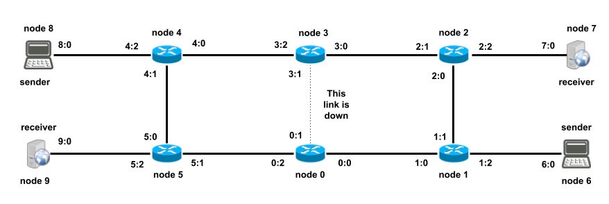
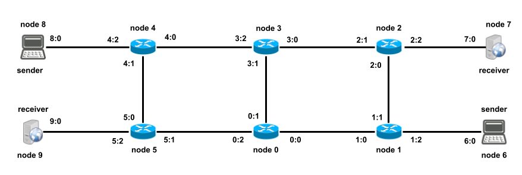

# Routing Protocols Using The Flooding Algorithm

In this Assignment we will use CNSS to develop a routing protocol based on the Flooding Algorithm. Students must enhance a provided naive flooding solution, and introduce filtering and optimization capabilities in the forwarding process implemented by *switching nodes*.

A deeper discussion of the subject is available in **chapter 15** of the course support book.

The basic flooding algorithm is very simple. It requires switching nodes to maintain **no state** besides the set of their active interfaces. In short, whenever there is a packet to forward, not addressed to the receiving node, the algorithm simply sends a copy of that packet to all the node's interfaces, except the one from which the packet arrived.

If the network is a **tree, i.e., it has no cycles**, the packet will reach the destination, provided there is a path from the origin node to the destination one. The only drawback is that several useless copies of the same packet will get to other nodes of the network but the original sender. These useless copies are discarded by all non destination nodes, i.e., nodes whose adddress is different from the destination address of the packet.

In this assignment we will use the network depicted in the figure below to test and develop the different versions of the algorithm. Initially, we will consider a state of that network where the link connecting nodes 4 and 5, as well as the link connectiong nodes 3 and 0, are both shutdow. As such, the network will have no cycles.



In this network some nodes act as Sender nodes and periodically send a *ping like packet* to the receiver node in a variable of their code named `dest`, as shown in their `on_clock_tick()` upcall available below. In the same code fragment are also shown upcalls `on_receive()` and `showState()`.

```java
public void on_clock_tick(int now) {
	countSent++;
	byte[] pl = Integer.toString(countSent).getBytes();
	DataPacket p = self.createDataPacket(dest,pl);
	self.send(p);
	log(now, " sent "+p+" payload "+countSent);
}

public void on_receive(int now, DataPacket p) {
	countReceived++;
	log(now, " received "+p+" payload: " + new String(p.getPayload(), StandardCharsets.UTF_8)); 
}
	
public void showState(int now) {
	System.out.print("Node status for node "+node_id+" ("+NAME+") "+"time "+now+" -");
	System.out.println(" sent "+countSent+" packet(s)"+" / received "+countReceived+" packet(s)");
}
```
Similar to your well known *echo service*, receiver nodes reply to the original sender of these packets.

```java
public void on_receive(int now, DataPacket p) {
	countReceived++;
	countSent++;
        self.send( self.createDataPacket( p.getSource(), p.getPayload() )  );
	log(now, " received / replyed "+p+" payload: " + new String(p.getPayload(), StandardCharsets.UTF_8)); 
}

public void showState(int now) {
	System.out.print("Node status for node "+node_id+" ("+NAME+") "+"time "+now+" -");
	System.out.println(" sent "+countSent+" packet(s)"+" / received "+countReceived+" packet(s)");
}
```
The code below shows the method `flood_packet()` which is used by the ´ControlAlgorithm´ of all switching nodes to forward packets not directly addressed to them.

```java
private void flood_packet (int now, Packet p, int iface) {
	int copiesSent = 0;
	// do the flood
	for (int i = 0; i < links.length; i++) {
		if (i != iface && links[i].isUp()) {
			// always send a copy of p, not the object itself
			nodeObj.send(p.getCopy(), i);
			copiesSent++;
		}
	}
	if (copiesSent == 0) { // allows the local node to count dropped packets
		nodeObj.send(p, UNKNOWN);
	}
	trace(now, "forwarded " + copiesSent + " packet copy(ies)");
}
```
In the above method, parameter *iface* is the interface from which packet *p* has been received. The variable *links* of classes extending `ControlAlgorithm` is an array representing the interfaces (and the attached links) of the node. The control algorithm of sender and receiver nodes, as they only have one single interface, use a simpler `ControlAlgorithm` provided with the basic library of CNSS - any non locally directed packet is always sent using the only available interface. If such packet was received from the network arriving by the single node interface, the flood algorithm dictates that it should be dropped.

Configuration file [configs/config4.1](configs/config4.1) allows you to make a first simulation test of the basic naive flooding algorithm, provided in class [src/Flood.java](src/Flood.java), by issuing the following command (or an equivalent action compatible with your development environment):

```
java -cp bin:cnss/bin cnss.simulator.Simulator configs/config4.1
```
It is possible to analyse statistics on how the flood routing process is executed, since, at the end of the simulation, sender and receiver nodes print their final statistics (`dumpappstate 39000 all`) and all nodes also print statistics on the numbers of packets they processed (`dumppacketstats 39000 all`). In the printed lines of these last statistics, characters used before values mean the following (in all the presented cases, the corresponding counters have been incremented when the condition occurs):

* **s - sent** (a packet was sent by the node or the link)
* **r - received** (a packet was received by the node or the link)
* **d - dropped** (a packet was dropped because its TTL was going to reach 0 or there was no available interface to forward it)
* **f - forwarded** (the forwarded algorithm of the node has been called)

If you want to have a detailed look on how the [configs/config4.1](configs/config4.1) simulation progresses, you can uncomment the line `parameter trace` what will trigger the printing of tracing messages by the different control algorithms. That allows one to a have a much clear idea on how the routing of packets is progressing.

After that you can proceed to simulations with different network configurations, namely, one that at time stamp 18000 puts the link from node 0 to node 3 **up**, see file [configs/config4.2](configs/config4.2), as shown in the figure below.


From that moment on, the network has cycles and becomes similar to a ring network (with some "legs"). You can test it by running the next simulation:

```
java -cp bin:cnss/bin cnss.simulator.Simulator configs/config4.2
```
As you can see, things now perform very differently. Not only because nodes receive many duplicate packets, but also because the only way a flood stops is because something special arises to the forwarded packets. Guess what and explain why it happens. If you want to have a more detailed look at the deluge of events you must run the simulation with tracing on. 

Another interesting observation is to compare the time a flood takes to end when the network has no cycles (afer the first packet is sent at time = 10000), to the time it takes when the network is not acyclic. You can look at it by using command `less` to stop the progress of the printing of the simulation results (continuation requires you to touch the "space" key).

```
java -cp bin:cnss/bin cnss.simulator.Simulator configs/config4.2 | less
```
You can abort the simulation as soon as you got the comparison done. You can try to justify the values by looking at the initial value of the TTL parameter of packets and the paths they use in the network. This value is set at Packet creation time by the constructor of class `cnss.simulator.Packet`. You can also try to devise a simple method to make the flood stop earlier. Can your methdod be generalised to any network?

# Your First Delivery (that can be marked at most 14 marks)

The goal of your first delivery is to enhance the provided [src/FloodForStudents](src/FloodForStudents) class to also implement a flooding optimisation, known as **learning by the reverse path**, which leverages the fact that in an acyclic network, if a node `N` receives by interface `I` a packet originally sent by source `S`, then `I` is the beginning of a (unique and therefore shortest) path from `N` to `S`. After implementing it, to switch this optimization on, the only required action should be to uncomment the line  `parameter filter` in the configuration file.

By using file [configs/config4.1](configs/config4.1), with filtering on and off, it is easy to see that the number of duplicate packets drops with filtering on. This is easier to realize with tracing on if you introduce a tracing action in your enhanced implementation that traces when a packet was forwarded to one only interface, instead of being flooded. This optimisation seems to have a radical implication since when performing simulation [configs/config4.2](configs/config4.2), with filtering on and off, it seems that  **learning by the reverse path** is capable of avoiding all duplicates per se. 

Performing the same simulations with file [configs/config4.3](configs/config4.3), which uses the network shown below, with all links up after time = 18000 and therefore more cycles than the previous one, it can be observed that with filtering off, floods seem never end, while doing the same simulation with filtering on, the number of duplicates drops radically and, once again, floods stop quite soon.



However, is it possible to prove that this kind of filtering is capable of avoiding most floods and the reception of all duplicate packets? It is not possible to prove it because it is a false assertion. To prove that it is not true, it is enough to find a counterexample. For this, you can try the same simulations with a new version of sender nodes. One where each sender also sends a packet to a switch node using, for example, the upcall `on_clock_tick` below

```java
public void on_clock_tick(int now) {
	countSent++;
	byte[] pl = Integer.toString(countSent).getBytes();
	DataPacket p = self.createDataPacket(dest,pl);
	self.send(p);
	countSent++;
	p = self.createDataPacket(5,pl);
	self.send(p);
	log(now, " sent "+p+" payload "+countSent);
}
```
by wich sender nodes also send a packet to the switching node number 5 at each clock tick. Running again the same simulation, even with filtering on, one realises that node 5 instead of receiving 6 packets from other nodes, receives 114 packets, while all other nodes received 0. Switching nodes use an empty `ApplicationAlgorithm` class and therefore ignore the received application packets.

# Optional Assignment Delivery (that can be marked at most more 6 marks)

The method capable of avoiding all duplicate packets during floods requires switching nodes to detect and drop them. Implementing it is your next job challenge.

The provided class `Flood`, when the parameter `drop_duplicates` is set, should execute all the required actions to implement duplicate packets dropping.

```java
public void forward_packet(int now, Packet p, int iface) {
		
		if ( drop_duplicates ) {
			// your code here
			// if you conclude that the packet is a duplicate, then execute the 3 following lines
			// trace(now, "dropped duplicate");
			// nodeObj.send(p, UNKNOWN);
			// return;
		} 
		
		if ( p.getDestination() == nodeObj.getId()) {
			Packet localPacket = p.getCopy();
			nodeObj.send(localPacket, LOCAL);
			trace(now, "forwarded a packet locally sent to this node");
			return; // all done
		}

		if ( p.getDestination() == Packet.BROADCAST ) {
			Packet localPacket = p.getCopy();
			localPacket.setDestination(nodeObj.getId());
			nodeObj.send(localPacket, LOCAL);
			trace(now, "forwarded a copy of a broadcasted packet to this node");
		}
		
		if ( filter ) {
			// your code here
		}
		
		flood_packet (now, p, iface);
	}
```
To achieve this goal, you have to devise a technique to detect duplicates by making nodes to record the least possible internal identifying state on the packets previously forwarded. Your solution must forward the least possible number of packets using configuration [configs/config4.4](configs/config4.4), a network with all links up from the beginning, as shown in the figure below.


To devise a way of detecting if a packet is a duplicate, you need to compute some sort of key that can be used to discriminate or identify a packet, something with the properties of a packet unique identifier. For a start, it seems that two packets with exactly the same header and the same payload could be considered as being the same packet. Therefore, the key could be computed using some hash function having them as input.

In reality, things are more complicated. In fact, in a certain network, nothing prevents a node of sending two different packets, packets P1 and P2, to the same destination, and with the same payload. Therefore, both will have the same payload and only the headers may be used to decide if P1 and P2 are the same packet or different packets. In fact, they are different packets, sent at different moments, and only the network header may tell that since the payload is useless for that purpose.

One can then look at the headers used in a specific network protocol to see if it contains information that can be used to decide if P1 and P2 are different or the same packet. In CNSS (as well as IPv4 as we will see later) there is a field in the header that changes from P1 to P2. In CNSS that field is called **sequence number** and can be accessed using method `getSequenceNumber()`, like in `p1.getSequenceNumber()`, which returns an `int`.  Therefore, looking at the full list of packets header fields (look at CNSS documentation or at the source code of class `Packet` to see what is a CNSS packet) one can devise a method to compute a *workable* version of that key. Lets use that one, but you can look at the end of this subject to have a deeper look on secured ways of identifying packets.

After executing that simulation with your last enhancement, all application nodes (sender and receiver nodes) only send 3 packets and receive 3. They also drop exactly one packet received by their only link. Can you explain both facts? 

Now switching nodes seem to forward the minimal number of packets while using flooding, and drop the received duplicate packets. Recall that switching nodes 3 and 5 only receive the first useless floods and then, as the network learned where destination nodes are, do not receive any more useless packets. Switching nodes 1, 2, 4 and 5 receive and forward the packets sent and received from the attached application nodes (6 packets), as well as some extra packets also flooded in the first round.

```
Node status for node 6 (sender) time 39000 - sent 3 packet(s) / received 3 packet(s)
Node status for node 7 (receiver) time 39000 - sent 3 packet(s) / received 3 packet(s)
Node status for node 8 (sender) time 39000 - sent 3 packet(s) / received 3 packet(s)
Node status for node 9 (receiver) time 39000 - sent 3 packet(s) / received 3 packet(s)
Pkt stats for node 0 time 39000 -  s 4 r 0 d 2 f 4
  (node:0 ifc:0) r 1 s 1 <--> (node:1 ifc:0) r 1 s 1
  (node:3 ifc:1) r 1 s 2 <--> (node:0 ifc:1) r 2 s 1
  (node:5 ifc:1) r 2 s 1 <--> (node:0 ifc:2) r 1 s 2
Pkt stats for node 1 time 39000 -  s 9 r 0 d 1 f 8
  (node:0 ifc:0) r 1 s 1 <--> (node:1 ifc:0) r 1 s 1
  (node:1 ifc:1) r 4 s 4 <--> (node:2 ifc:0) r 4 s 4
  (node:1 ifc:2) r 3 s 4 <--> (node:6 ifc:0) r 4 s 3
Pkt stats for node 2 time 39000 -  s 9 r 0 d 1 f 8
  (node:1 ifc:1) r 4 s 4 <--> (node:2 ifc:0) r 4 s 4
  (node:2 ifc:1) r 1 s 1 <--> (node:3 ifc:0) r 1 s 1
  (node:2 ifc:2) r 3 s 4 <--> (node:7 ifc:0) r 4 s 3
Pkt stats for node 3 time 39000 -  s 4 r 0 d 1 f 3
  (node:2 ifc:1) r 1 s 1 <--> (node:3 ifc:0) r 1 s 1
  (node:3 ifc:1) r 1 s 2 <--> (node:0 ifc:1) r 2 s 1
  (node:3 ifc:2) r 1 s 1 <--> (node:4 ifc:0) r 1 s 1
Pkt stats for node 4 time 39000 -  s 9 r 0 d 1 f 8
  (node:3 ifc:2) r 1 s 1 <--> (node:4 ifc:0) r 1 s 1
  (node:4 ifc:1) r 4 s 4 <--> (node:5 ifc:0) r 4 s 4
  (node:4 ifc:2) r 3 s 4 <--> (node:8 ifc:0) r 4 s 3
Pkt stats for node 5 time 39000 -  s 9 r 0 d 2 f 9
  (node:4 ifc:1) r 4 s 4 <--> (node:5 ifc:0) r 4 s 4
  (node:5 ifc:1) r 2 s 1 <--> (node:0 ifc:2) r 1 s 2
  (node:5 ifc:2) r 3 s 4 <--> (node:9 ifc:0) r 4 s 3
Pkt stats for node 6 time 39000 -  s 3 r 3 d 1 f 4
  (node:1 ifc:2) r 3 s 4 <--> (node:6 ifc:0) r 4 s 3
Pkt stats for node 7 time 39000 -  s 3 r 3 d 1 f 4
  (node:2 ifc:2) r 3 s 4 <--> (node:7 ifc:0) r 4 s 3
Pkt stats for node 8 time 39000 -  s 3 r 3 d 1 f 4
  (node:4 ifc:2) r 3 s 4 <--> (node:8 ifc:0) r 4 s 3
Pkt stats for node 9 time 39000 -  s 3 r 3 d 1 f 4
  (node:5 ifc:2) r 3 s 4 <--> (node:9 ifc:0) r 4 s 3
```

Your solution may be confronted with other CNSS network configurations.

# A final note on devising packets secure unique identifiers

Devising a method to assign unique identifiers to objects without relying on counters fully realiable and with boundless resolution is quite complex. In fact, real nodes can crash and their packets sequence numbers counters may be reused. Also, if a node sends packets at reasonable high speed, it can easily exahaust the available sequence numbers range and start reusing them by going from 0 up to MAXINT, then to = 0, then from 1 up to MAXINT again, and so on.

In IPv4 the header field that plays a similar role to a sequence number is called the packet `identifier` and is represented in 16 bits. Thus, its value is reused after sending around 65000 packets. In IPv6 there is no such header field, and two different packets sent at different times by the same node, to the same destination node, and with the same payload, would be considered indistinguishable packets by the network. In CNSS the sequence number is an `int`, thus, it is only reused after sending more than 4 million packets.

Thus, in CNSS and IPv4, without solving these two problems, there is no simple way to build unique identifiers for packets at network level that resist node crashes and integers range exhaustion. The better you can expect is that sucessive node crashes moments, or packets emission with the same sequence numbers moments, differ time enough to make the crashes and the sequence numbers reuse harmless. For example, by guaranteeing that all old copies of the same packet have already desapeared from the network and cannot make harm or introduce confusion. With this approach, your solution could use a timmer to periodically clean all traces of old packets keys, and the initial value of the sequence number counter should be set randomly. The same problem has already been tackled a propos of TCP connections initial sequence numbers. This discussion is complex and requires that a **Packet Max Life Time** parameter for the Internet must be adopted with the sole purpose of making correctness proofs.

By using criptographically secured methods to guarantee that no two different packets can be considered the same is a problem solved using identifiers with a greater number of bits (256 or more) as well as some form of randomness that solves the problem introduced by the crash and reinitialization of counters.

Once again, you should note that networks are engineering artifacts that use methods whose cost is adjusted to the risks involved. Modern TCP/IP networks do not guarantee that all sent packets get to destination in time, or if they do, it is also not guaranteed that receiving nodes will not receive dulicates. It is the business of higher layers to solve these problems using budgets adequate to the task at end.


