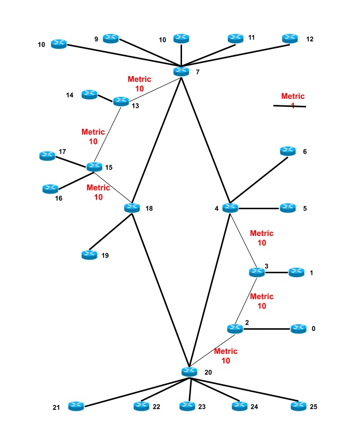

# Implementing Distance-Vector Routing

## Introduction

In this assignment you will write distance-vector (DV) routing code for a simple switching node or router. Look at the lecture notes and slides of the course, namely chapter 16 of the book supporting this course. Although we do not require or expect you to implement that standardized version, you will also find it useful to refer to RFC2453 (RIP Version 2), which describes the Routing Information Protocol (RIP), a very long-standing distance-vector routing protocol.
 
Note that we expect you to implement the algorithm and protocol as presented in the lecture notes, following the different steps suggested below and including setting of the appropriate routing table entries’ metrics to a reserved INFINITY value when a link goes down. That is, your protocol must be realistic enough to be used in a real network where links may go down or up.

We provide you with a skeleton of the control algorithm for a distance-vector router running in CNSS, found in file `DVControl.java`. You should implement your solution to the assignment by filling in the missing parts of this file. Do not change any of the constants that we’ve pre-defined in that file neither the flags setting code at the beginning of the `initialise()`upcall, which control the options your solution implements.

We also give you a function to compute the metric of a link as well as two classes. The first one, implements a Routing Table Entry. The second one, implements the payload of CNSS control packets used to send and receive distance vector or reachability announcements.

Note that you should not modify any files used in the coursework apart from `DVControl.java`. All the code you write will go in this file. 

### Acknowledgements

This assignment has been adapted from the coursework 2: "Implementing Distance-Vector Routing" of the course COMP0023: Networked Systems, University College London, Department of Computer Science.


## Initial guidelines

### The routing table of a node

All your versions of the protocol do not keep for future use the received distance vector announcements (some versions of the algorithm store them to select alternatives when the distance to a known destination becomes INFINITY). Therefore, your code will use just one data structure: a sligthly extended routing table or FIB (forwarding information base). For each destination, the routing table stores the interface to forward packets to reach that destination, a metric or cost of the path to get there, as well a time stamp denoting the last time this entry has been modified or confirmed. That timestamp will be useful for certain optional versions of your solution. File `RoutingTableEntry.java` contains a class that implements a routing table entry.

A router will start with a routing table with one only entry, the one that points to itself, i.e. with its own identification, uses the LOCAL interface to forward packets, has metric 0, and a timestamp corresponding to the starting moment, i.e. 0 in CNSS. If `rt` denotes your routing table, that initialization could be

```java
rt.put(nodeId, new DVRoutingTableEntry(nodeId, LOCAL, 0, now) );
```

### Sending periodic announcements

You should start by implementing the basic version of the algorithm, one that periodically sends distance vector announcements to neighbours reachable by all the node's interfaces that are operational (i.e. in the state `up`). Your node's interfaces are available, in CNSS, in the array `Link[] links` and are numbered from 0 to `nInterfaces`. Both variables are initialised in the `initialise()` upcall using configuration parameters received from the CNSS node code.

To send a control packet containning an announcement as payload (stored in an object of the appropriate class, see below, pointed by `payload`) to the neighbour at the other side of an operational link, connected to the local interface `interface`, use the following code:

```java
Packet p = nodeObj.createControlPacket(nodeId, Packet.ONEHOP, payload.toByteArray() );
nodeObj.send( p, interface );
```

`Packet.ONEHOP` is a special destination address that represents the node at the other side of a link.

### Distance-vector announcements

Class `DVControlPayload` (in file `DVControlPayload.java`) has all you need to build and process distance vector announcements. You should study it carefully and learn how to use that class in your implementation.

You should then implement the basic version of the algorithm. Later, we will also ask you to implement three further enhancements or optimizations: triggered updates, split horizon with poison-reverse, and timeout-based expiration of routing table entries. 

### Skeleton of your solution

We provide you with a skeleton of the control algorithm for a distance-vector router running in CNSS, found in the file `DVControl.java`. You should implement your solution to the assignment by filling in the missing parts of this file. Do not change any of the pre-defined parts in that file.

### Options in the code

In the beginning of the `initialise()` method, you find the code needed to initialise the variables (flags) that represent the options that the algorithm must implement when they are true.

```java
tracingOn = parameters.containsKey("trace");
preverse = parameters.containsKey("preverse");
expire = parameters.containsKey("expire");
triggered = parameters.containsKey("triggered");
```
Thus, if you implement some or all of these options, the code implementing them must be surrounded by a condition. For example:

```java
if ( triggered ) send announcements;
```
### Links metric or cost

We also give you a function to compute the metric of a link as well as the two classes already referred above.

Again, note that you should not modify any of the provided files apart from `DVControl.java`. All the methods in that file (initialise and upcalls) are extensivly documented. You should follow the directions in these comments.


## Configuration files provided and running tests

**Preliminary important note:** before compiling and testing your solution, you must upgrade your CNSS version. See the annex to see one way, among several of the possible ones, of doing it.

As you already know, each time you run CNSS it reads a configuration file that describes the particular network topology it should simulate, and any actions to take during that simulation (and when to take them), such as “take this link down after 15000 milliseconds,” “print out the routing table of this router after 32000 milliseconds,” etc.

We have prepared 8 of these configuration files, each with the purpose of testing different stages of your development. These files are named `config5.1.txt`, `config5.2.txt`, ... `config5.8.txt`. The purpose of each one will be explained below when we will refer to each of the these stages.

We also provide in directory `results`, for each configuration file, a file named `results5.1.txt`, `results5.2.txt` etc. These files contain the output of running a simulation using a `DVControl.java` class performing correctly the stage defined by the flags initialised in the corresponding configuration file.

As you already know, to run a CNSS simulation in the command line, you may use the following command: 

```
java -cp bin:../cnss/bin cnss.simulator.Simulator configs/config5.1.txt
```

It assumes that you are developing your project in the current directory (it may be named `assignment5` for example, and command `pwd` will print its name if you are lost), with a sub directory containing your source files (directory `src` with files `DVControl.java`, `RoutingTableEntry.java` and `DVControlPayload.java`) a directory named ` bin` with the compiled version of your files and a directory named `configs` with the configuration files. 

With the above command line, CNSS compiled code should be in the directory `../cnss/bin`. You can prepare it by creating the directory `../cnss`, geting the CNSS code from its GitHub repository and compiling it in that directory. See the annex for a quick "how to" to do it.

It is also possible to developpe with any IDE (Interactive Developping Environment), as for example Eclipse, that will support a project CNSS in the `cnss` directory and compile it to some directory `cnss/bin`. Otherwise you should adapt the above command to the way your IDE organizes the `.class`files.

In the annex we provide a crash course on one of the ways of installing the required files to support your development.

## Developing your solution

### Stage 1: baseline distance-vector protocol

In this stage you must implement a baseline DV routing protocol that only sends periodic announcements, does not supports poison reverse and does not get stale entries out of the routing tables. No separate design document is required, but you must comment your code thoroughly, to fully explain how it works.

When a clock tick event is triggered, your node calls the `on_clock_tick()` upcall in your code. It must prepare an annoucement payload and send it throughout each of the node's interfaces, for example using:

```java
for ( int i = 0; i < nInterfaces; i++)
	if ( links[i].isUp() ) sendsDistanceVectorAnnouncement(...);
```

You also need to fill in the code of the other upcalls (`on_link_up()`, `on_link_down()` and `on_receive()`) with the apropriate actions. In the  `on_receive()` upcall you process a reachability announcement just received.

The tests `config5.1.txt` and `config5.2.txt` check the correctness of your baseline DV router implementation. Therefore, they do not set the triggered updates, split horizon with poison-reverse or timeout-based table entry expiration flags. 

Leave these three features disabled in these tests’ configuration files! You will be marked based on your router’s behavior on these tests with these features disabled.


Both configurations test the ring network of the figure above. During the execution some links change state: go down and up. The second configuration shows how a count to infinity event may take place when we are only using the baseline DV. This happens when all links connecting node 1 to other nodes go down and node 1 becomes isolated and unreachable from the rest of the network.

Both configuration files show how to send trace packets and the result of their execution. Trace packets are sent using the configuration file command 

```
traceroute time origin destination
```
It allows one to trace the path in the network of a packet sent from `origin`to `destination` at time stamp `time`. When there is a routing loop, it is also clearly shown. Routing loops only come to an end when the packets' RTT reaches 0.


### Stage 2: Add triggered updates

In this stage you must add triggered updates, that is, whenever something changes in your routing table, or some of the interfaces of the node change their state (upcalls `on_link_up()`or `on_link_down()`) you must send announcements by all nodes' operational interfaces. Remember that the full treatment of an `on_link_down()` also requires changing the state of the affected entries of the nodes' routing table. 

Note that you will need to send or not triggered updates in your router in accordance with the setting of the `triggered` flag in the configuration file. The flag `triggered` setting in the config file is available in the boolean variable `triggered`  in your code. Thus, using this variable, sending these announcements should begin with

```java
if ( triggered ) send a triggered update
```

Following the directives in the configuration file, CNSS changes the state of a link. At that moment, the interfaces the link connects to also change state. All these changes take place before the node calls the corresponding upcalls in your `DVControl` class.

Now you should run tests using `config5.3.txt` to realize that with triggered updates the count to infinity anomaly will not happen this time. File `config5.3.txt` is equal to file `config5.2.txt` with the difference that triggered updates flag (`triggered`) is set.

Test `config5.4.txt` allows you to test a much more complex network with more links' up and down events, as well as using several traces to probe your nodes routing performance. The network in this test has 25 nodes and is a reprodution of the English universities network backbone (JANET) at the beginning of this century. That network is depicted below.



### Stage 3: Add split horizon with poison-reverse

In this stage, you must add split horizon with poison-reverse to improve the convergence behavior of your DV routing implementation. That improvement must be implemented by the method that sends announcements since it only concerns the way DV announcements are build.

Note that you will need to enable or disable split horizon with poison-reverse in your router in accordance with the setting of the `preverse` flag in the configuration file, which you can test using the boolean value of variable `preverse` in your code.

We’ve given you two test cases, `config5.5.txt` and `config5.6.txt`, that have `triggered` and `preverse` flags set to on. That’s the configurations in which we will use these two tests when marking your submission. Both networks are shown in the figures below.


However, the first part of this stage may be to explore how your baseline router, without triggered updates neither split horizon with poison-reverse, behaves on these topologies.

When testing your split horizon with poison-reverse implementation, be sure the two flags are on! And similarly, if you want to run without them, after the implementation of this stage, be sure to turn these flags off.

### Stage 4: Add expiration of stale table entries

In this stage, you must enhance your DV implementation further to expire routing table entries as necessary. Note that the DV algorithm described in lectures allows routing table entries to persist indefinitely. 

But if a destination goes down and stays down, routers do not need to maintain routing table entries for that destination. In fact, deleting such entries from routing tables will reduce the size of subsequently exchanged routing messages. 

In fact, in some cases, some DV announcements contain destinations at distance INFINITY. If that one was a previously reachable destination, this announcement requires an update to the routing table. If such an announcement was already known to the router, the corresponding routing table should not be refreshed.

You will need to enforce a deadline after which stale entries for unreachable destinations should be removed from the routing table.

We require that you remove stale entries in accordance with the timeout policy suggested in RFC2453 (which you will find a very useful reference): an entry should be removed as a function of u, the update interval. For this work, remove entries after  3 update intervals as stale entries.

Note that part of the mechanism specified in the RFC handles the loss of routing update packets. The tests we provide, however, never drop routing update packets, so you do not need to incorporate mechanisms for dealing with such losses. Finally, note that expiration of entries for unreachable destinations helps reduce the size of the routing table and subsequent announcements, but doesn’t hasten convergence.

`config5.7.txt` and `config5.8.txt` configurations are used to test for the removal of stale routing table entries. Both work on the same network, the already mentioned JANET national backbone. In test  `config5.7.txt` several links go up and down, and during a certain period node 16 stays unreachable. In test `config5.8.txt`, during the lifetime of the simulation several links go down and the network becomes partitioned.

These configuration files tests enable all flags: triggered updates, split horizon with poison-reverse and stale table entry expiration.

Note that you will need to enable or disable stale table entry expiration in your router in accordance with the setting of the `expire` flag in the configuration file, which you can test using the boolean value of variable `expire` in your code.


## Comparing with a correct solution

As we have already referred above, for each test we also provide the output of a correct solution to this assignment. You can test your solution as indicated above and compare its output with the one of a correct solution. For this, you can redirect the output of your test to a file and then compare it with the expected one (diff command can help).


## Marking (in 0-20 scale)

We will get your `DVControl.java` file, compile it with CNSS and the files `DVControlPayload.java`and `DVRoutingTableEntry.java` and then run tests. We will allocate marks to your solution as follows:

A solution with compile errors will be marked 0

A solution not being able to correctly perform Stage 1 tests (`config5.1.txt` and `config5.2.txt`): will be marked at most 6

A solution correctly performing Stage 1 tests (`config5.1.txt` and `config5.2.txt`): will be marked at most 13

A solution correctly performing Stage 1 & 2 tests (`config5.1.txt` up to `config5.4.txt`): will be marked at most 15

A solution correctly performing Stages 1, 2 & 3 tests (`config5.1.txt` up to `config5.6.txt`): will be marked at most 17

Solutions that implement all stages and pass all tests (`config5.1.txt` up to `config5.8.txt`) have no a priori grading limitations.

Code clarity and structure will also be taken into account.


## Annex - Sugestions to set-up your work environment

This annex contains a quick crash course on how to instal CNSS, the assignment files, as well as to prepare your environment for developping in the command line. In the assignment 0 notebook, you also find instructions for how to use a development environment and use it. The directories organization will be very similar to the one presented below. Following the instructions in assignment 0, you can install CNSS by performing the following actions.

Start by choosing a directory (root directory of your work) to contain all the files you need to work in your assignment. Make that directory your curernt directory and perform the following actions:

```
git clone https://github.com/jlegatheaux/cnss
cd cnss
mkdir bin
javac -d bin src/*/*/*.java
cd ..
```

You can then install the assignments files and start your developemnt and tests. Download file  `assignment5.zip` from this repository to your working directory, that is, the one that contains the `cnss` directory created above, and type the following commands:
```
unzip assignment5.zip
cd assignment5
mkdir bin
javac -d bin -cp ../cnss/src/ src/*.java
```

Now, you have two dirtectories: `cnss` and `assignement5`. You work in the last one. Modify your `src/DVControl.java` file and compile it. To test it inside the `assignment5` directory use, for example

```
java -cp bin:../cnss/bin cnss.simulator.Simulator configs/config5.1.txt
```
To test and compare with the expected results type

```
java -cp bin:../cnss/bin cnss.simulator.Simulator configs/config5.1.txt > result5.1.txt
diff result5.1.txt results/result5.1.txt
```

Naturally, as most of us, you prefer to edit and compile your source files with an IDE, like Eclipse for example. The main difference is that your root directory should be the working directory of your IDE, and you must create two projects, one for cnss and another for assignment5. Probably, you will end with exactly the same directories strucuture as the one suggested above.


